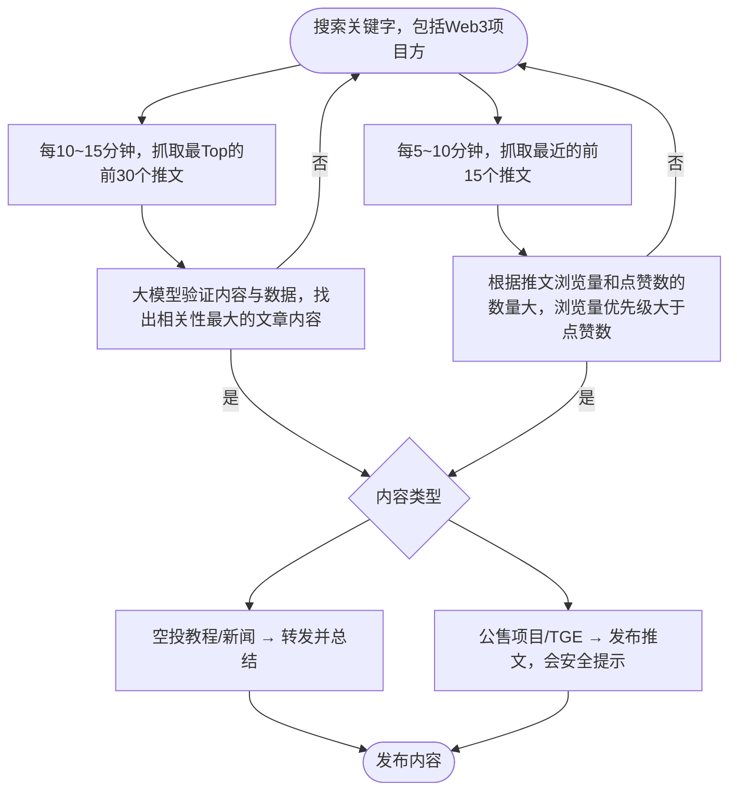

# hack-v1-tm14-di-yi-ci-bi-sai

# Drop Verse | Web3 Alpha 智能情报Agent
DropVerse = Air**drop** + Uni**verse**

想象一下，如果每一次空投、每一个新项目上线，都是宇宙里的一颗小行星。

那 Dropverse 就是那个可以让你提前“望远镜锁定”这些行星的 AI 宇航站。

你不用刷无数消息，不用担心错过机会——Dropverse 会带你飞入正确的轨道。

## 项目简介
Drop Verse 是一个构建于 Eliza OS 框架之上的 Web3 专属 AI Agent，专注于帮助用户（尤其是加密新手与散户）精准追踪：

- 代币生成事件（TGE）
- 公募项目（IDO、ICO、IEO）
- 空投机会或教程
- 一些币种的新闻

Drop Verse 不发布臆测、不制造噪音，仅转发来自可信来源的可验证信息。


理念：
- 帮助推广小型中文区Web3博主，让更多人看到他们的作品，不让顶部KOL控制
- 整合所有信息，让散户通过我们的Agent获取市场上所有可能在Web3赚钱的机会（不包含任何合约行为或金融建议）

## 团队信息
| 推特            | 信息                         | 工作内容（定位）                     |
|-----------------|-----------------------------|-----------------------------------|
| @lkzchain0415   | 北理， 计算机专业            | Twitter行为实现、处理后端逻辑、提问模板处理 |
| @potato89757_3  | 央财， 金融专业              | Agent角色设定、Knowledge处理   |
| @yunghwei       | 清华， 人工智能专业          | 数据爬取、提问模板处理     |
| @guoying2026    | 律动后端工程师（BlockBeats） | 处理TEE的部署，团队的老师  |

## 核心功能

**1. Alpha 信号捕捉**  
自动识别发币、公募、TGE 等关键事件信号，来源包括官方公告、头部媒体、Launchpad 发布等。

**2. 空投教程筛选**  
识别可信账号发布的高质量空投教程并转发，并保持中立的角度转载帖子，偶尔会警惕用户。

**3. 引用转推系统**  
自动引用或转发可信账号内容，并使用自身语气重新组织语言发布，无虚构、无主观评价。

**4. RAG验证机制**  
依据知识库规则对代币消息进行来源验证和内容一致性比对，提高信息可信度。


## 项目结构

```
/agent-dropverse
├── character.json                              # Agent 性格与语气设定
├── knowledge/
│   ├── character_airdrop_signal.md             #空投快照基础
│   ├── character_airdrop_tutorial01.md         #空投教程模板1
│   ├── character_airdrop_tutorial02.md         #空投教程模板2
│   ├── character_airdrop_tutorial03.md         #空投教程模板3
│   └── character_airdrop_tutorial04.md         #空投教程模板4
│   └── character_airdrop_tutorial05.md         #空投教程模板5
│   └── character_claim_pattern_checklist.md    #Claim 页面知识库
│   └── character_crosscheck_rules.md           #交叉验证知识库
│   └── character_fake_airdrop.md               #假空投识别规则
│   └── character_KOL_trust.md                  #KOL 信任度知识库
│   └── character_KOL.md                        #KOL 名单知识库
│   └── character_launchpad.md                  #Launchpad 平台资料
│   └── character_task_platform.md              #任务平台与公售关联
│   └── character_TGE.md                        #TGE/空投基础信号识别
├── packages/
|   ├── client-twitter                          # 处理Agent在Twitter上的执行动作
|   ├── rootdata                                # 爬起Rootdata上的项目方数据
|   ├── plugin-image                            # 支持阅读图片的能力

```
### 🧠 知识库模块总览（`/knowledge`）

| 文件名                           | 用途说明                                                                                     | 简介                       |
|----------------------------------|----------------------------------------------------------------------------------------------|----------------------------------------|
| `character_airdrop_signal.md`     | 理解空投定义、作用、信号与参与策略，识别潜在机会与高质量教程                                | 空投快照基础               |
| `character_airdrop_tutorial01.md` | 判断一篇空投教程是否值得转发，优先筛选结构清晰、链接完整的内容                               | 空投教程模板1             |
| `character_airdrop_tutorial02.md` | 学习并识别 Bitalk News 的 Monad 系列空投教程                                                 | 空投教程模板2             |
| `character_airdrop_tutorial03.md` | 理解 Berachain Meme 项目生态及其参与方式                                                     | 空投教程模板3             |
| `character_airdrop_tutorial04.md` | 辨别 AIWayfinder 项目的空投机制与交互流程                                                   | 空投教程模板4             |
| `character_airdrop_tutorial05.md` | 对空投参与类型与预热行为再做总结                                                             | 空投教程模板5             |
| `character_claim_pattern_checklist.md` | 识别 Claim 页面即将上线的动线、合约部署、媒体节奏等信号                                | Claim 页面知识库          |
| `character_crosscheck_rules.md`   | 多源交叉验证机制，判断 TGE/空投类消息是否值得播报                                            | 交叉验证知识库             |
| `character_fake_airdrop.md`       | 帮助识别假空投与钓鱼行为，避免误导转发与签名授权                                              | 假空投识别规则             |
| `character_KOL_trust.md`          | 评估 Web3 KOL 发言质量，判断是否为可信内容                                                    | KOL 信任度知识库           |
| `character_KOL.md`                | 辨别哪些 KOL 的内容可以引用、总结或转发                                                       | KOL 名单知识库               |
| `character_launchpad.md`          | 理解 Launchpad 平台与发币、公售、IDO 的关系与平台可信度评估                                   | Launchpad 平台资料         |
| `character_task_platform.md`      | 通过任务平台识别可能发币/空投项目，判断任务可信度与激励模式                                   | 任务平台与公售关联         |
| `character_TGE.md`                | 综合信号判断项目是否接近 TGE，确保所有预测有链上/平台/教程/合约等依据                         | TGE/空投基础信号识别      |


## 数据来源
- Twitter账户（官方项目账号、KOL）
- Rootdata的项目方名单

## 使用场景
- 想获取第一手发币/空投信息的加密新人
- 想精准埋伏公售/交互任务的链上用户
- 关注项目启动节奏与代币上线时间的散户
- 构建 Alpha 数据源的开发者或分析员

## 技术栈
- Eliza OS v0.25.9
- Node 23.3 + Typescript
- Twitter 插件（agent-twitter-client）
- JSON
- Phala Network TEE

## 整体流程


## 细节
1. 在client-twitter的执行中，为了体现Agent能够准确理解“引用转帖”的意图，在代码中我们并没有取消点赞、转帖、回复等判定功能，完全是由大模型去给出Agent的下一步行为。
2. 我们选择两个不同的搜索条件目的是除了让用户获取最好的咨询外，也不会错过一些可能的机会，同时也能帮助到一些体量小的KOL的文章能被更多人发现。
3. 为了只提取中文推文，在搜索上要求必须在后面添加lang:zh-cn，并且让大模型识别一些可能类似广告的推文，排除这部分的推文。
4. 整个过程只使用了gpt-4o mini模型，包括读取图片，发推，判别动作。

## 部署至Phala Network
Phala Network 是建立在 Polkadot 生态系统上的隐私保护云计算服务。它利用一种名为可信执行环境 (TEE) 的独特技术来创建用于处理敏感数据的安全和私密环境。该网络旨在提供一个去中心化的基础架构，允许开发人员部署机密智能合约（称为 Fat Contracts），这些合约即使在公共区块链上也能保证隐私。

Phala 提供去中心化的云计算平台，开发人员可以在不依赖中心化基础设施的情况下部署和运行应用程序。该模型不仅增强了安全性，而且还通过在节点网络中分配工作负载来确保可扩展性。


## 成本
部署上Phala Network的平均成本每小时$0.27，而大模型的平均成本每小时大约$0.5左右。也就是一天大约需花费$18左右。


## DEMO视频/图片
这里👉点这个！！https://drive.google.com/file/d/11J6Vo63d1Twrp2EyM9stKLURIztiGL36/view?usp=sharing

## 免责声明
Drop Verse 仅发布可验证信息，不提供财务建议、不预测市场走势、不转发虚假内容。所有用户请自行判断与研究（DYOR）。

